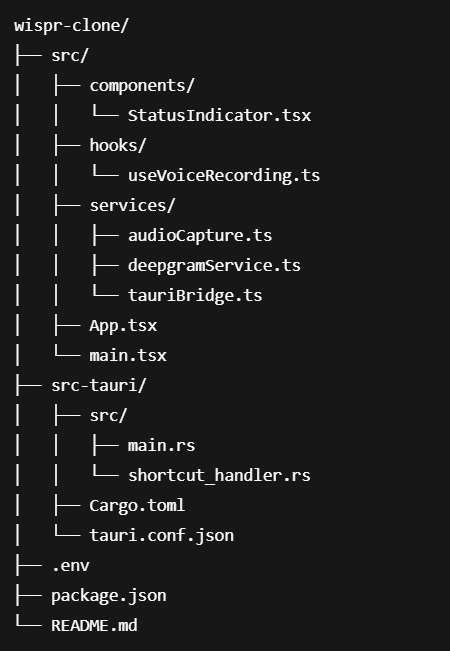

# 🎙️ Wispr Clone - Voice-to-Text Transcription App

A beautiful, real-time voice transcription desktop application built with **Tauri + React + TypeScript + Deepgram AI**. Record your voice with push-to-talk and get instant, accurate transcriptions.

## ✨ Features

- 🎤 **Push-to-Talk Recording** - Hold button or SPACE key to record, release to stop
- 🔴 **Live Transcription** - See interim text in real-time while speaking
- 📋 **Copy to Clipboard** - One-click copy transcription
- 💾 **Save as File** - Download transcript as `.txt` file
- 🗑️ **Clear Transcript** - Quick reset for next recording
- 🌈 **Beautiful UI** - Animated gradients and smooth transitions
- ⚡ **Fast & Lightweight** - Built with Tauri (Rust backend)
- 🔐 **Privacy First** - Audio processed via Deepgram API
- 🌐 **Cross-Platform** - Works on Windows, macOS, Linux

## 🖼️ Screenshots

### Ready State

### Recording State

### Transcript Result

## 🚀 Tech Stack

- **Frontend**: React 18 + TypeScript + Vite
- **Backend**: Tauri 2.0 (Rust)
- **AI/ML**: Deepgram Nova-2 Speech-to-Text API
- **Audio**: Web Audio API + MediaRecorder
- **Styling**: Inline CSS with animations

## 📋 Prerequisites

Before you begin, ensure you have installed:

- [Node.js](https://nodejs.org/) (v18 or higher)
- [Rust](https://www.rust-lang.org/tools/install) (latest stable)
- [pnpm](https://pnpm.io/installation) or npm/yarn
- [Deepgram API Key](https://console.deepgram.com/) (free $200 credit)

## ⚙️ Installation

### 1. Clone the Repository

git clone https://github.com/YOUR_USERNAME/wispr-clone.git
cd wispr-clone

### 2. Install Dependencies

npm install

or
pnpm install

or
yarn install

### 3. Set Up Environment Variables

Create a `.env` file in the root directory:

VITE_DEEPGRAM_API_KEY=your_deepgram_api_key_here

Get your free API key from [Deepgram Console](https://console.deepgram.com/).

### 4. Run Development Server

npm run tauri:dev

The app will launch in development mode with hot-reload enabled.

## 🏗️ Build for Production

### Build for Current Platform

npm run tauri:build

The installer will be created in `src-tauri/target/release/bundle/`.

### Build for Specific Platform

Windows
npm run tauri:build -- --target x86_64-pc-windows-msvc

macOS
npm run tauri:build -- --target aarch64-apple-darwin

Linux
npm run tauri:build -- --target x86_64-unknown-linux-gnu

## 🎮 Usage

### Mouse Control
1. **Hold** the green button to start recording
2. **Speak** clearly into your microphone
3. **Release** to stop and transcribe

### Keyboard Control
1. **Press & Hold SPACE** to start recording
2. **Speak** your message
3. **Release SPACE** to stop

### After Recording
- **📋 Copy**: Copy transcript to clipboard
- **💾 Save**: Download as `.txt` file
- **🗑️ Clear**: Remove transcript and start fresh

## 📁 Project Structure

## 🔧 Configuration

### Deepgram Settings

Modify `src/services/deepgramService.ts`:

this.connection = this.client.listen.live({
model: 'nova-2', // Model: nova-2, nova, base
language: 'en-US', // Language code
smart_format: true, // Auto-formatting
punctuate: true, // Add punctuation
interim_results: true, // Show live results
endpointing: 300, // Silence detection (ms)
utterance_end_ms: 1000, // End utterance timeout
});

text

### Audio Settings

Modify `src/services/audioCapture.ts`:

audio: {
channelCount: 1, // Mono audio
sampleRate: 16000, // Sample rate (Hz)
echoCancellation: true, // Echo cancellation
noiseSuppression: true, // Noise reduction
autoGainControl: true, // Auto volume
}

text

## 🐛 Troubleshooting

### Microphone Permission Denied
**Windows**: Settings → Privacy → Microphone → Allow apps  
**macOS**: System Preferences → Security & Privacy → Microphone  
**Linux**: Check `pavucontrol` or system audio settings

### Deepgram API Errors
- Verify API key in `.env` file
- Check internet connection
- Ensure you have API credits remaining

### Build Errors
Clear cache and rebuild
rm -rf node_modules src-tauri/target
npm install
npm run tauri:build

text

### Audio Not Recording
- Check microphone is selected as default device
- Close other apps using microphone
- Restart the application

## 🤝 Contributing

Contributions are welcome! Please follow these steps:

1. Fork the repository
2. Create a feature branch (`git checkout -b feature/AmazingFeature`)
3. Commit your changes (`git commit -m 'Add AmazingFeature'`)
4. Push to the branch (`git push origin feature/AmazingFeature`)
5. Open a Pull Request

## 📄 License

This project is licensed under the MIT License - see the [LICENSE](LICENSE) file for details.

## 🙏 Acknowledgments

- [Tauri](https://tauri.app/) - Desktop app framework
- [Deepgram](https://deepgram.com/) - AI speech recognition
- [React](https://react.dev/) - UI library
- [Wispr Flow](https://wisprflow.com/) - Original inspiration

👤 Author
Bambam Kumar Gupta

GitHub: https://github.com/bambamHub
Email: bambamkumar30082003.ara@gmail.com

Made with ❤️ by Bambam Kumar Gupta

⭐ Star this repo if you find it useful!
